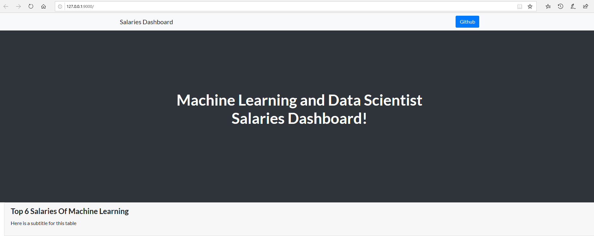
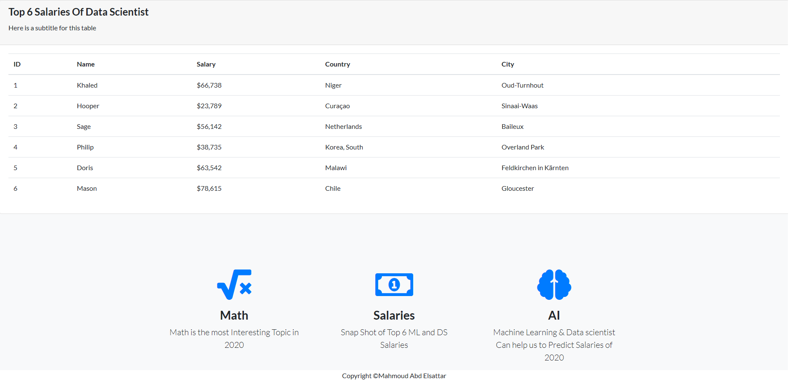

# A Simple Salaries Dashboard

A dashboard for Machine Learning and Data Scientist Salaries Dashboard!



### Run dashboard on local host, it's still a little bit slow, but that's an early version, most probably i will be working on it's performance.

## Installation

to use the dashboard follow these steps

* create a virtualenv and activate it

```bash
$python -m venv venv
$source venv/bin/activate
```

* install all the requirements

```bash
$pip install -r requirements.txt
```

Now you are ready to go !

* start the app from `app.py`

```bash
$python app.py
```

you will find a message ending with the url like so

```bash
 * Running on http://127.0.0.1:9000/ (Press CTRL+C to quit)
```

Jump into the link and you will directed to the Dashboard page



## References

* Icons by [https://fontawesome.com/icons/]
